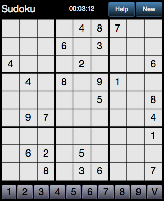

# sudoku #

## Usage ##

You can play at [http://mbj-sudoku.appspot.com](http://mbj-sudoku.appspot.com).

It is optimized for screen width 320px, but works well with others.

The game can be played offline (full functionality).

A tip on iPhone is to add the app to home screen.

### Pre-requisites ###

1. Install sass (sudo gem install sass)
2. Install compass (sudo gem install compass)

### Installation and start ###

1. Clone this repo
2. Run "npm start" in the root of your clone
3. Start to play sudoku

## TODOs ##

* Inject dependencies and add tests
* Add mechanism to update version in appengine-web.xml from git tag
* Add versioning to saved game
* Automatically fill in when only one note left in square?
* Remove &nbsp;
* High score
* Add instructions here
